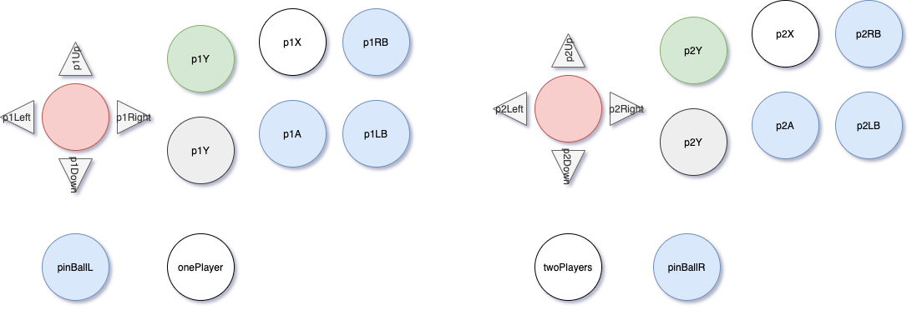

# arcadeKeyMap

This module is to have the proper keys setup for the arcade cabinets. It stores the keys in the local storage of your browser. there you can change them to your preference. For reference this is the mapping in the keys:



Default keys that are set:

```javascript
    capacadeKeys = {
      p1Up: 'W',
      p1Down: 'S',
      p1Left: 'A',
      p1Right: 'D',
      p1Y: 'R',
      p1X: 'T',
      p1B: 'F',
      p1A: 'G',
      p1RB: 'Y',
      p1LB: 'H',
      p2Up: 'I',
      p2Down: 'K',
      p2Left: 'J',
      p2Right: 'L',
      p2Y: 'P',
      p2X: 'C',
      p2B: 'V',
      p2A: 'B',
      p2RB: 'N',
      p2LB: 'M',
      pinBallL: 'Z',
      pinBallR: 'X',
      onePlayer: 'Q',
      twoPlayers: 'U',
    };
```

## how to use

Install the module:
`npm install --save-dev @capacade/arcadekeymap` And in you phaser  code like so:

```javascript
  import getKeys from '@capacade/arcadekeymap';
  this.keys = this.input.keyboard.addKeys(getKeys());
```

Njoy!
